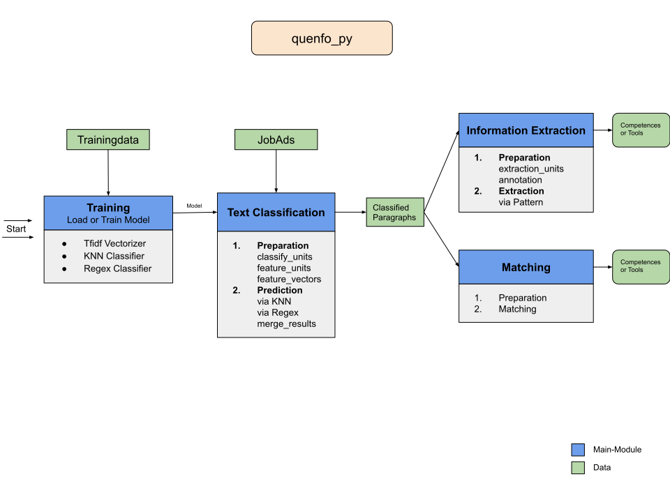
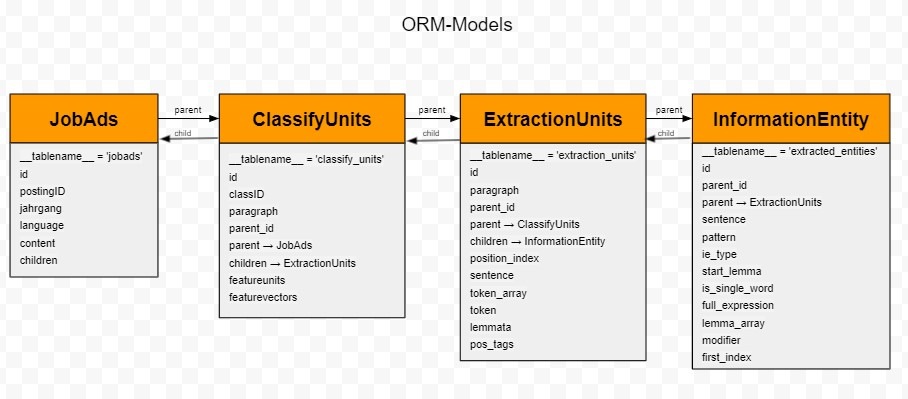
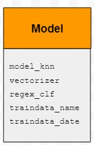

#### 👷‍♀️⚠️ Work in Progress ⚠️ 👷‍♀️

## Dokumentation quenfo_py
***
Die Software **quenfo_py** bietet verschiedene Funktionen zur Verarbeitung von Stellenanzeigen an.
Diese unterteilen sich in die Klassifikation von Stellenanzeigen, in die Informationsextraktion von Kompetenzen und Tools und in Matching-Workflows zum Auffinden bereits bekannter Entitäten innerhalb klassifizierter Paragrafen.
In dieser Dokumentation werden die jeweiligen Workflows beschrieben. Dabei werden die einzelnen Schritte und die genutzten Klassen und Methoden aufgeführt. 
Jede ausführbare Applikation arbeitet mit Object Relational Mapping (ORM). Objekte werden hierbei als Datenbankeinträge persistiert, d.h. in den Datenklassen (z.B. in den Klassen ClassifyUnits, ExtractedEntity, InformationEntity oder ExtractionUnit) werden entsprechende Annotationen an Klassenattributen vorgenommen, um diese als vorzunehmenden Eintrag zu kennzeichnen. Für die Realisierung wurde [SQLAlchemy](https://docs.sqlalchemy.org/en/14/orm/) genutzt. 

Die Software entstand im Projekt [Quenfo](https://dh.phil-fak.uni-koeln.de/forschung/qualifikationsentwicklungsforschung) 
und in Kooperation mit dem Bundesinstitut für Berufsbildung.


**Zielsetzung:**

	a. Stellenanzeigen werden in Paragraphen aufgesplittet und klassifiziert.
			Mögliche Klassen: 
			1. Selbstvorstellung des ausschreibenden Unternehmens
			2. Beschreibung der Tätigkeit, Angebote an die Bewerberinnen und Bewerber
			3. Anforderungen an die Bewerberin bzw. den Bewerber 
			4. Formalia und Sonstiges
			5. 1&3
			6. 2&3
   
	b. Informationsextraktion von Kompetenzen und Tools aus klassifizierten Paragraphen
	c. Matching-Workflows zum Auffinden bereits bekannter Entitäten innerhalb klassifizierter Paragrafen.

**Input:**

	Trainingsdaten (SQL-Datenbank mit bereits klassifizierten Stellenanzeigen)
	Input-Daten (SQL-Datenbank mit Stellenanzeigen)

**Hauptstruktur:**

	Textclassification
	Information Extraction
	Matching

**Output:** SQL-Datenbank bestehend aus:

	SQL-Tabelle mit klassifizierten Paragraphen
	SQL-Tabelle mit ExtractionUnits (Tools oder Kompetenzen)
	SQL-Tabelle mit MatchingUnits (Tools oder Kompetenzen)
	
--> Mehr zu Input und Output siehe Ende der Readme

***
### Quickstart🏃
***
Die Anwendung wurde in Python 3.7 geschrieben.

Klone das Repository

`git clone https://github.com/agerlac1/quenfo_py.git`

cd in den Ordner **quenfo_py/code**: hier liegt die requirements Datei und das Programm wird von hier ausgeführt (working dir)

`python -m pip install -r requirements.txt`

Mit der nachfolgenden Ausführung wird das gesamte Programm samt Default-Settings aufgerufen (Input-und Trainingsdaten müssen zuvor in der quenfo_data
Struktur liegen und die Dateinamen in der config.yaml Datei angegeben werden.)

--> Textclassification, Information Extraction, Matching

`python main.py --input_path "absolute_path_to_input_data" --db_mode {overwrite,append}`

--> Input- und Trainingsdaten müssen in der quenfo_data Struktur liegen.

Informationen über die erfolgten Abläufe und Ergebnisse werden in dem Modul `/logger` in den entsprechenden logging-Dateien gespeichert.

***
### Workflow🔁
***
Im Folgenden wird der Workflow der **quenfo_py** Software beschrieben.

#### Allgemein

Allgmein besteht die Software aus 3 bzw. 4 Hauptmodulen. Zunächst wird das Trainings-Modul aufgerufen, in welchem das Model geladen oder je nach dem neu trainiert wird.
Danach beginnt der Hauptprozess der Software, in dem die zu verarbeitenden Stellenanzeigen erst klassifiziert werden und dann Informationen zu Kompetenzen oder Tools extrahiert und bereits bekannte Entitäten gematched werden.



Im folgenden sieht man die Klassenstrukturen der ORM-Models:




#### Code Struktur
Der Code ist so struktuiert, dass sich die einzelnen Module (im Workflow s.o. erkennbar) ebenfalls in der Ordnerstruktur wiederfinden.
```
📦quenfo_py
 ┣ 📂additional_scripts
 ┣ 📂code
 ┃ ┣ 📂classification
 ┃ ┃ ┣ 📂predict_classes
 ┃ ┃ ┃ ┣ 📜knn_predictor.py
 ┃ ┃ ┃ ┣ 📜regex_predictor.py
 ┃ ┃ ┃ ┣ 📜result_merger.py
 ┃ ┃ ┃ ┗ 📜__init__.py
 ┃ ┃ ┣ 📂prepare_classifyunits
 ┃ ┃ ┃ ┣ 📂classify_units
 ┃ ┃ ┃ ┃ ┣ 📜convert_classifyunits.py
 ┃ ┃ ┃ ┃ ┗ 📜__init__.py
 ┃ ┃ ┃ ┣ 📂feature_units
 ┃ ┃ ┃ ┃ ┣ 📜convert_featureunits.py
 ┃ ┃ ┃ ┃ ┗ 📜__init__.py
 ┃ ┃ ┃ ┣ 📂feature_vectors
 ┃ ┃ ┃ ┃ ┣ 📜convert_featurevectors.py
 ┃ ┃ ┃ ┃ ┗ 📜__init__.py
 ┃ ┃ ┃ ┗ 📜__init__.py
 ┃ ┃ ┗ 📜__init__.py
 ┃ ┣ 📂configuration
 ┃ ┃ ┣ 📜config_model.py
 ┃ ┃ ┗ 📜__init__.py
 ┃ ┣ 📂database
 ┃ ┃ ┣ 📜connection.py
 ┃ ┃ ┗ 📜__init__.py
 ┃ ┣ 📂information_extraction
 ┃ ┃ ┣ 📂prepare_extractionunits
 ┃ ┃ ┃ ┣ 📂extraction_units
 ┃ ┃ ┃ ┃ ┣ 📜convert_extractionunits.py
 ┃ ┃ ┃ ┃ ┗ 📜__init__.py
 ┃ ┃ ┃ ┗ 📜__init__.py
 ┃ ┃ ┣ 📂prepare_resources
 ┃ ┃ ┃ ┣ 📜connection_resources.py
 ┃ ┃ ┃ ┣ 📜convert_entities.py
 ┃ ┃ ┃ ┗ 📜__init__.py
 ┃ ┃ ┣ 📜helper.py
 ┃ ┃ ┣ 📜models.py
 ┃ ┃ ┗ 📜__init__.py
 ┃ ┣ 📂logger
 ┃ ┣ 📂orm_handling
 ┃ ┃ ┣ 📜models.py
 ┃ ┃ ┣ 📜orm.py
 ┃ ┃ ┗ 📜__init__.py
 ┃ ┣ 📂tests
 ┃ ┣ 📂training
 ┃ ┃ ┣ 📂knnclassifier
 ┃ ┃ ┃ ┣ 📜gen_knn.py
 ┃ ┃ ┃ ┗ 📜__init__.py
 ┃ ┃ ┣ 📂regexclassifier
 ┃ ┃ ┃ ┣ 📜gen_regex.py
 ┃ ┃ ┃ ┗ 📜__init__.py
 ┃ ┃ ┣ 📂tfidfvectorizer
 ┃ ┃ ┃ ┣ 📜gen_vectorizer.py
 ┃ ┃ ┃ ┗ 📜__init__.py
 ┃ ┃ ┣ 📜helper.py
 ┃ ┃ ┣ 📜train_models.py
 ┃ ┃ ┗ 📜__init__.py
 ┃ ┣ 📜main.py
 ┃ ┗ 📜requirements.txt
 ┣ 📂docs
 ┣ 📜.gitignore
 ┗ 📜README.md
```

***
### Implementierung und Module 🛠️
***

#### Hauptbestandteile: Training, Classification, IE und Matching
##### Training
Das Trainingsmodul besteht erstens aus dem Abgleich, ob ein Modell bereits vorhanden ist oder ob ein neues trainiert werden soll.
Dafür wird einmal überprüft, ob bereits ein Model für den TfidfVectorizer und den KNN-Classifier vorliegt (Dateinamen dazu in config.yaml gesetzt). Liegt jeweils eins vor, wird überprüft,

1. ob die vorliegenden Trainingsdaten auch für das Modell verwendet wurden und 
2. ob die Konfigurationseinstellungen der Modelle mit denen in der config.yaml gesetzten übereinstimmen.
3. ob die Modelle auch gefittet sind.

Sollten dementsprechend neue Trainingsdaten vorliegen oder neue Konfigurationseinstellungen gesetzt worden sein oder die geladenen Modelle nicht gefittet sein, wird neu trainiert oder andersrum der entsprechende Vectorizer und Classifier geladen.
Anschließend werden diese für das Objekt der Klasse Model als Werte gesetzt.

Zuletzt wird noch der RegexClassifier geladen, der sich aus den gegebenen Mustern und ihren Klasseneinteilungen aus der Support-Datei *regex.txt*  ergibt. Auch diese werden in Form eines Dataframes als RegexClassifier im Model gesetzt.



Das bedeutet, dass am Ende des Trainingsmoduls ein Objekt der Klasse Model zurückgegeben wird, welches aus den drei Komponenten (Tfidf, KNN & Regex) besteht und noch zusätzlich Informationen über die genutzten Trainingsdaten enthält.

##### Classification
Die Textclassification ist in zwei Hauptschritte aufgeteilt:

1. **Vorbereitung der zu klassifizierenden Stellenanzeigen** (*prepare_classifyunits/*) in den Schritten:

	1. Generierung von **classify_units** durch splitten der Stellenanzeigen in Paragraphen (und erste Normalisierungsschritte)
	2. Verarbeitung der Paragraphen zu **feature_units** (Tokenization, Normalization, Stopwords Removal, Stemming, NGram(or ContinuousNGram) Generation)
	3. Vektorisierung der feature_units zu **feature_vectors** mittels des **Tfidf-Vectorizers**(aus dem Objekt Model).

2. **Vorhersage der Klassen für die vorverarbeiteten Paragraphen** (*predict_classes/*) in den Schritten:
	1.  **KNN-Prediction** mittels des KNN-Classifiers aus dem Model.
	2.  **Regex-Prediction** mittels des Regex-Classifiers aus dem Model.
	3. Abgleich und Zusammenführen der beiden Vorhersagen (**merge_results**)


##### Information Extraction
TODO
##### Matching
TODO

#### Support Module

##### configuration
Das configuration-Modul enthält :
1. das **config_models.py** Script, in dem die Klasse *Configuration* definiert wird, die getter, setter und checks für die in der Konfigurationsdatei enthaltenen Werte enthält.
--> Die dazugehörige config.yaml Datei (in der die Konfigurationseinstellungen und Filenamen enthalten sind), befindet sich in der quenfo_data Struktur.

##### orm_handling
Das Modul *orm_handling/* ist das Verbindungsstück zwischen Datenbank und Python-Tool. Hier werden Daten abgefragt und in Datenbanken geschrieben, mithilfe der Definition von Models, die die Datenbank-Tabellen abbilden. Verwendet wurde das Python-Package [SQLAlchemy](https://docs.sqlalchemy.org/en/14/orm/) um Object Relational Mapping umzusetzen.

1. `models.py`
Script um Klassen und Schmeata für ORM-Objects zu definieren.
Classes:
        JobAds               --> JobAds to be splitted and classified
        ClassifyUnits        --> preprocessed and classified paragraphs
        TrainData            --> Traindata (already in paragraphs and classified)
        ClassifyUnits_Train  --> contains each Traindata paragraph (preprocessed and classified)
        ExtrationUnits       --> preprocessed and splitted sentences from paragraphs
        InformationEntity    --> extracted entities
2. `orm.py` --> Script enthält query-Abfragen an die Datenbank und Funktionen, um Objekte Datenbanken hinzuzufügen (session.add(), session.commit()). Außerdem werden hier Hilfsfunktionen definiert, die ggf. Tabellen löschen und createn. 


##### database
`connection.py`: Script mit dem die connections zu den SQL-Datenbanken hergestellt  werden. --> Returns session-obj und engine-obj.

##### logger
Logging-Ordner, in dem zusätzliche Informationen während der Ausführung des Tools gespeichert werden.
Es gibt vier verschiedene Logging-files:
1. `log_main.log` --> for all main related processes and raises.
2. `log_clf.log`  --> for all classification related processes and raises.
3. `log_ie.log`   --> for all information extraction related processes and raises.
4. `log_match.log`--> for all matching related processes and raises.

##### tests
TODO

#### Files
**main.py**
Main-Skript des Tools. Hier befindet sich die grobe Architektur und Verwaltung des Programms. Des Weiteren sind hier die ArgumentParser Befehle deklariert, mit denen bestimmte Teile des Skriptes aufgerufen werden können (mehr dazu weiter unten).

**requirements.txt**
Enthält eine Auflistung an Python-Dependencies, die benötigt werden, um das Tool auszuführen.

**input, output**
Input-Path wird über die CMDLine mitgegeben und Output wird in die Input Datenbank reingeschrieben.

***
### Configuration📋✔️
***
In der Datei `config.yaml` sind alle Pfade und einstellbare Parameter vermerkt. Dadurch wird gewährleistet, dass im Code selbst für eine Anwendung nichts verändert werden muss. Alle Änderungen werden in der `config.yaml` Datei vorgenommen.

Ansonsten können folgende Werte angepasst werden:
- FeatureUnitConfiguration --> Wie sollen die FeatureUnits erstellt werden?
- Data-Handling Parameter --> Wie viele Stellenanzeigen sollen verarbeitet werden und in welcher Chunksize?
- Tfidf Configuration --> Wie soll der Vectorizer trainiert werden oder welcher soll geladen werden?
- KNN Configuration --> Wie soll der KNN Classifier trainiert werden oder welcher soll geladen werden?
- IE Configuration --> Wie soll die Information Extraction ablaufen?
- Model Paths --> Pfade zu den Modellen (Tfidf und KNN)
- Paths --> Resource Pfade zu den Benötigten Dateien

***
### CommandLine - Befehle📢
***
Alle Befehle werden relativ zum Ordner `code/` ausgeführt.

**Grundsätzlich:** 

    usage: main.py [-h] [--classification] [--extraction] [--matching]
               [--input_path INPUT_PATH] [--db_mode {overwrite,append}]

    classify jobads and extract/match information

    optional arguments:
    -h, --help            show this help message and exit
    --classification
    --extraction
    --matching
    --input_path INPUT_PATH
    --db_mode {overwrite,append}

**Beispiel**

`python main.py --classification --input_path "this/is/my/input/path.db --db_mode overwrite`
--> Hier wird nur die Classification aufgerufen und die im input_path mitgegebene Datei verarbeitet. Sollten bereits ClassifyUnits vorhanden sein, werden diese überschrieben.

`python main.py --input_path "this/is/my/input/path.db --db_mode append`
--> Da hier kein Wert mitgegeben wurde, welcher Teil des Tools aufgerufen werden soll, werden alle drei Steps nacheinander durchlaufen (1. Classification, 2. IE, 3. Matching). Da der db_mode *append*  gesetzt wurde, werden ClassifyUnits (die bereits gegeben sein könnten in der input_db) nicht überschrieben und nur noch nicht verarbeitete hinzugefügt.

`python main.py --classification --extraction --input_path "this/is/my/input/path.db --db_mode overwrite`
--> Hier wird erst die Classification und dann die IE aufgerufen und die im input_path gegebenen Daten verarbeitet. Der db_mode ist auf *overwrite* gesetzt. Dementsprechend werden, falls ClassifyUnits bereits vorhanden sind, diese überschrieben.


***
### Daten - Aufbau📚
***

#### Input
--> Datei muss in der entsprechenden quenfo_data Struktur liegen.
Als Input-Dateien müssen SQL-Datenbanken vorliegen. Die Tabelle mit den enthaltenen Stellenanzeigen sollte bestenfalls den Namen *jobads*  haben oder der neue Tabellenname muss manuell im Script *code/orm_handling/models.py *geändert werden. Die Daten müssen mindestens über folgende gefüllte Spalten verfügen, damit sie als Input-Daten verwendet werden können (egal ob als Test- oder Trainingsdaten):

- id
- content (Text der Stellenanzeige)
- postingID
- language
- jahrgang

#### Output

Tabelle zur Textclassification:
-  id
- classID
- parentID --> Zu welcher JobAd der Paragraph gehört
- paragraph

Tabelle zur Information Extraction:
Kompetenzen oder Tools werden als Entitäten durch Extraktionsmuster extrahiert
- id
- positionIndex
- paragraph_id
- sentence
- tokenArray

Tabelle zum Matching:
Kompetenzen oder Tools werden durch StringMatching gefunden
- id
- parent_id
- type
- startLemma
- singleWordEntitiy
- lemmaArray
- lemmaExpression
- modifier

#### Trainingsdaten als Input
--> Angabe des Dateinamens in config.yaml notwendig --> Datei muss in der spezifischen quenfo_data Struktur liegen.
--> Trainingsdaten als SQLite Datenbank 
--> Tablename = 'traindata' (oder Abänderung im Code orm.py)
Folgende Spalten müssen vorliegen:
- content
- classID
- index
- postingID
- zeilennr

--> Zusätzliches file *make_sql_traindata.py*  in *additional_scripts/* Folder kann benutzt werden um tsv-Dateien in SQLite Datenbank zu konvertieren.


